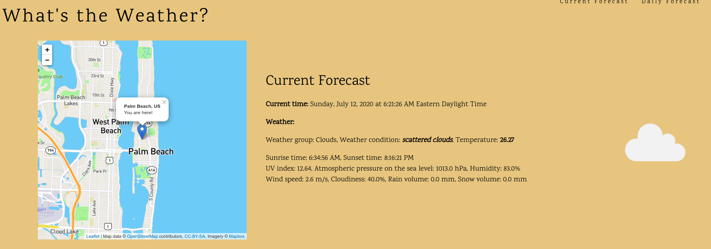

# weather
Project "What's the Weather?" from [beginner-projects by Jorge Gonzales](https://github.com/jorgegonzalez/beginner-projects)

## important
OpenWeatherMap.org does not process API requests without the API key. Go to [openweathermap.org](https://openweathermap.org/appid#get) and obtain an API key. Once you do that, fill in //TODO apiKey field in [weather.properties](resources/weather.properties). After that, you can run the program.
 
Also, if you want to generate HTML with street map, go to [mapbox.com](https://account.mapbox.com/access-tokens/) and request your access token. Once you do that, fill in //TODO accessToken field in [weather.properties](resources/weather.properties). The program will generate HTML file without map too.

# [Project text](https://github.com/jorgegonzalez/beginner-projects#whats-the-weather):

If you would like to know the basics of what an API is, check out [this](https://www.reddit.com/r/explainlikeimfive/comments/qowts/eli5_what_is_api/c3z9kok/) post by iamapizza.
<ul>
<li>Create a program that pulls data from OpenWeatherMap.org and prints out information about the current weather, such as the high, the low, and the amount of rain for wherever you live.</li>
<li>Subgoals:</li>
<ul>
<li>Print out data for the next 5-7 days so you have a 5 day/week long forecast.</li>
<li>Print the data to another file that you can open up and view at, instead of viewing the information in the command line.</li>
<li>If you know html, write a file that you can print information to so that your project is more interesting. Here is an example of the results from what I threw together.</li>
</ul>
<li>Tips:</li>
<ul>
<li>APIs that are in Json are essentially lists and dictionaries. Remember that to reference something in a list, you must refer to it by what number element it is in the list, and to reference a key in a dictionary, you must refer to it by it's name.</li>
<li>Don't like Celsius? Add &units=imperial to the end of the URL of the API to receive your data in Fahrenheit.</li>
</ul>
</ul>

# Description of solution

In [resources folder](resources) is a zipped .json list of cities downloaded from openweathermap.com. The program will first unzip it and ask you to enter the unit for temperature and the name of the city. In case there is more than one result for that name, the program will ask you to choose between options. After that, the program prints forecast to the console, to a text file and generate an appropriate HTML file.
 Example of a text file: [example.txt](resources/example.txt)
 Example of an HTML file without access token for mapbox.com: [example.html](resources/html/example.html). If you supplied your access token, the same output will look like in the image below.

